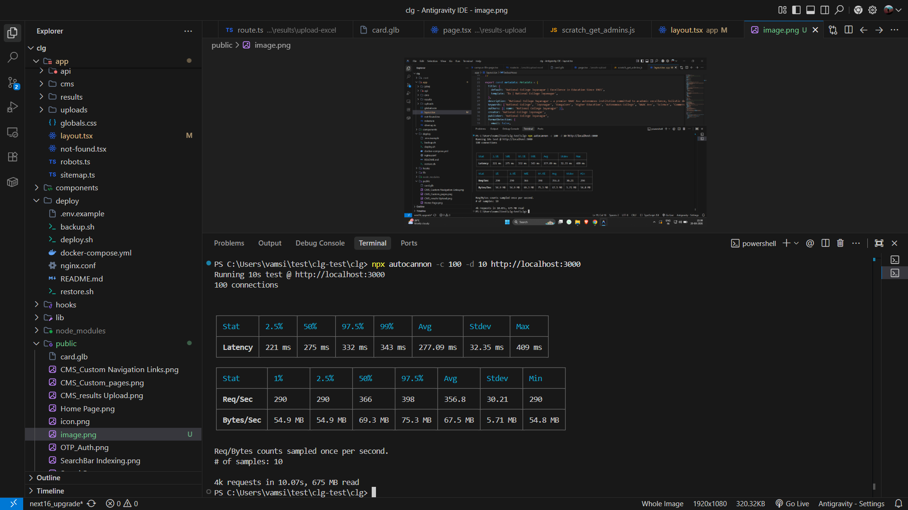
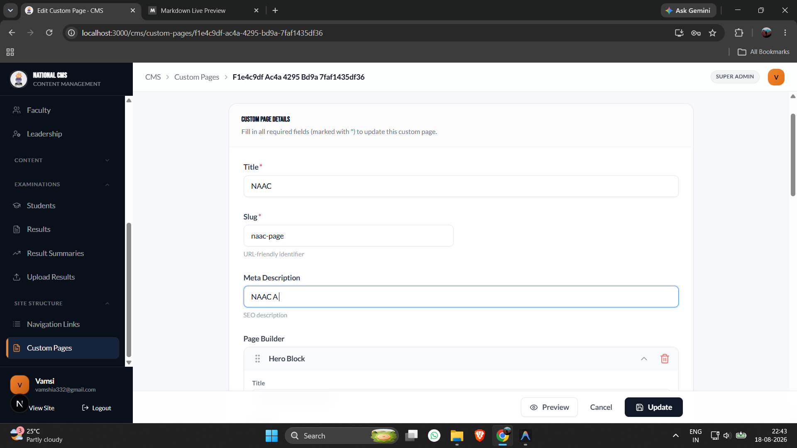
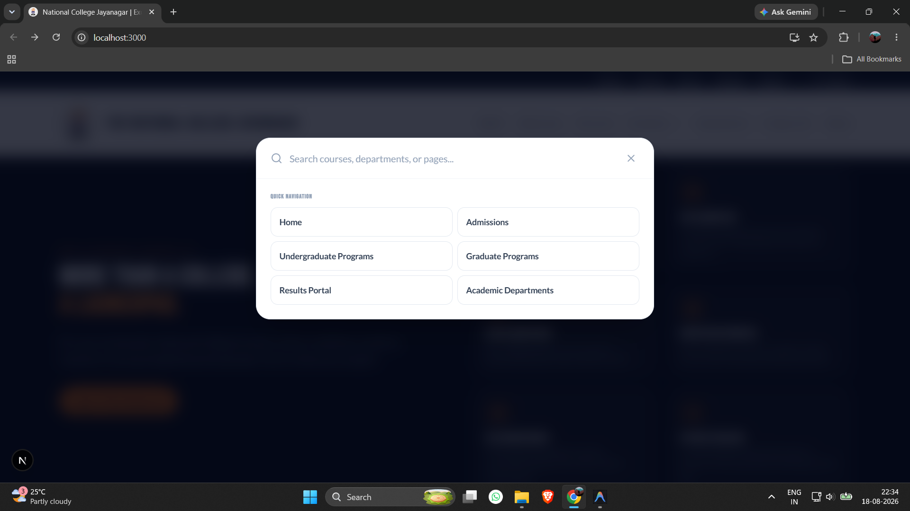
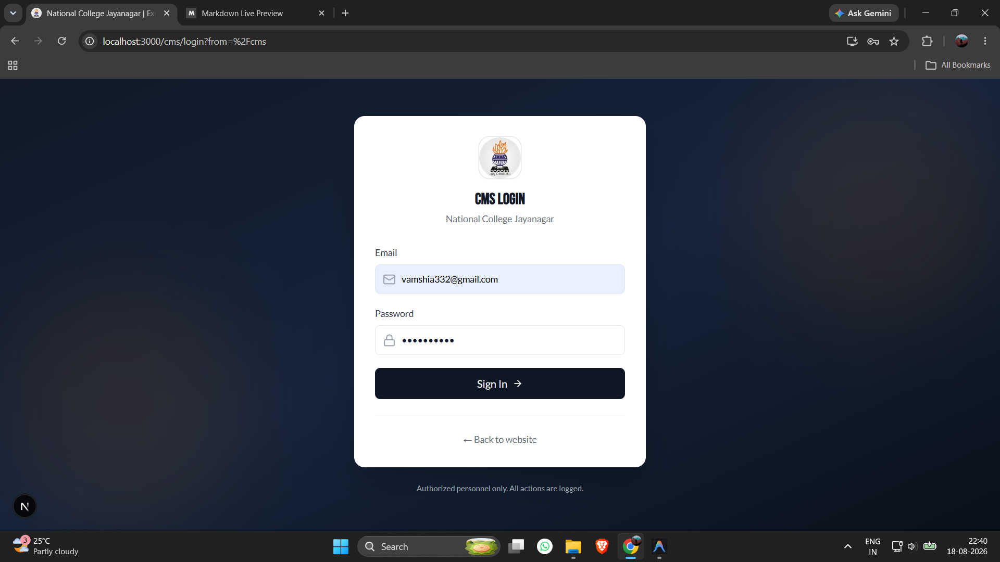
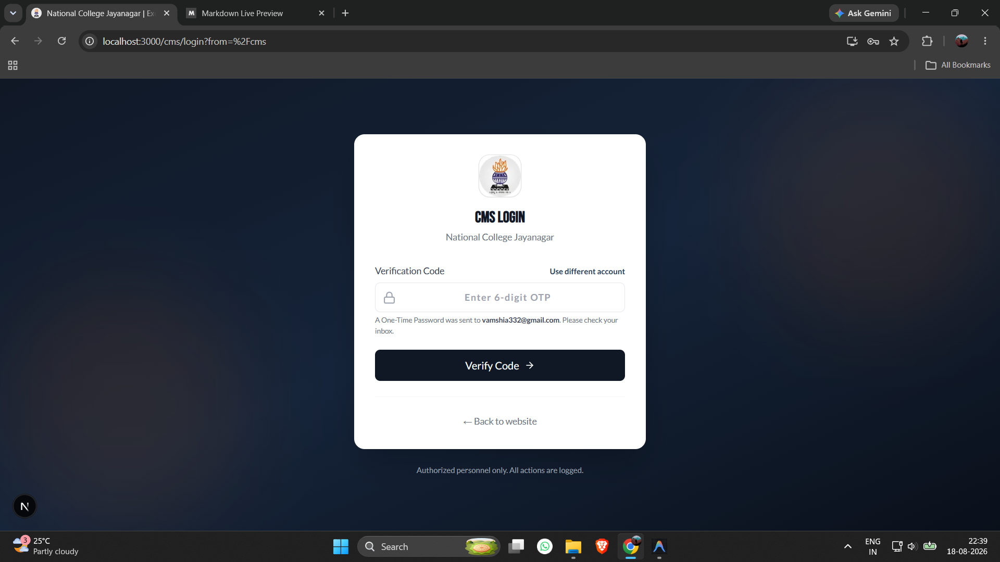

# Campus360 – Institutional Management Platform

> **Next.js, PostgreSQL, Supabase, REST APIs, CMS, RBAC**

A comprehensive, modern institutional management and web platform built for colleges and universities with Next.js, React, TypeScript, Tailwind CSS, PostgreSQL, and Supabase. This project features a high-performance public-facing portal alongside an authenticated, role-based Content Management System (CMS) for managing academic and administrative operations.

---

## 📌 Project Overview & Highlights

- **Engineered a CMS-driven institutional management platform** for managing departments, faculty, events, announcements, and institutional content through centralized administrative workflows.
- **Designed a relational PostgreSQL database** with 10+ tables and implemented structured data access workflows using Supabase for institutional content and management operations.
- **Developed reusable REST APIs** and server-side data access layers supporting content creation, editing, publishing, and retrieval across multiple institutional modules.
- **Implemented Role-Based Access Control (RBAC)** to secure administrative workflows and restrict content management operations based on user permissions.
- **Load-tested the application with 100 concurrent connections**, achieving 390+ requests/sec average throughput and 253 ms average latency across a 10-second benchmark handling 4,000+ requests.

---

## 🚀 Technology Stack

- **Framework:** Next.js (App Router)
- **Library:** React 19
- **Language:** TypeScript
- **Styling:** Tailwind CSS
- **UI Components:** Radix UI / shadcn/ui
- **Animations:** GSAP & Framer Motion
- **Database / Backend:** Supabase, PostgreSQL (`pg`)
- **Forms & Validation:** React Hook Form & Zod
- **Drag & Drop:** `@dnd-kit`
- **Charts:** Recharts
- **Icons:** Lucide React

## 📂 Project Structure

```text
├── app/                  # Next.js App Router root
│   ├── (site)/           # Public-facing website pages (about, academics, alumni, etc.)
│   ├── api/              # API routes
│   ├── cms/              # Authenticated Content Management System (RBAC protected)
│   └── ...
├── components/           # Reusable React components grouped by feature (gallery, students, ui, etc.)
├── deploy/               # Deployment scripts (e.g., restore.sh)
├── hooks/                # Custom React hooks
├── lib/                  # Utility functions and shared logic
├── public/               # Static assets & screenshots
├── scripts/              # Project maintenance scripts
└── types/                # TypeScript type definitions
```

---

## 🌟 Key Features

### ⚡ Performance & Load Testing
- Benchmarked under high concurrency using `autocannon` with **100 concurrent connections over 10 seconds**:
  - **Throughput:** ~357 - 398 Req/Sec (handling 4,000+ requests, 675 MB transferred)
  - **Latency:** ~253 - 277 ms average latency
  - **High Concurrency Stability:** Zero dropped connections during peak stress tests

  

### Content Management System (CMS)
- **Custom Pages:** Easily create and manage custom pages.
  
  

- **Custom Navigation Links:** Manage the main navigation menu dynamically.
  
  

- **Results Upload:** Dedicated interface for faculty/admins to upload student results.
  
  

- **Role-Based Access Control (RBAC):** Secure, authenticated `/cms` routes for administrative tasks.
- **Database & Storage:** Integrated with Supabase and PostgreSQL for robust data storage and media management.

### Public Website
- **Home Page:** A beautiful, responsive landing page for the institution.
  
  

- **Search Functionality:** Comprehensive search and indexing to easily find courses, news, and resources.
  
  
  

- **User Authentication:** Secure login for students, faculty, and administrators with OTP support.
  
  
  

- **Academics & Courses:** Detailed pages for academic programs, departments, and individual courses.
- **Admissions:** Information and resources for prospective students.
- **Student & Campus Life:** Dedicated sections for current students, campus activities, and visitor information.
- **News & Events:** Dynamic news and events boards.
- **Directories:** Faculty, staff, and alumni directories.
- **Interactive Galleries:** Dynamic image and media galleries.
- **Results Portal:** Dedicated student results section.
- **Targeted Portals:** Specific information tailored for Parents, Visitors, and Alumni.

## 🛠️ Prerequisites

- Node.js (v18 or higher recommended)
- npm or pnpm
- PostgreSQL / Supabase account (for database operations)

## 🚦 Getting Started

1. **Clone the repository** (if applicable) or navigate to the project directory:
   ```bash
   cd clg
   ```

2. **Install dependencies:**
   ```bash
   npm install
   ```

3. **Set up environment variables:**
   Copy the `.env.example` file to `.env` and fill in the required values (e.g., database connection strings, Supabase keys):
   ```bash
   cp .env.example .env
   ```

4. **Run the development server:**
   ```bash
   npm run dev
   ```
   Open [http://localhost:3000](http://localhost:3000) in your browser to view the application.

## 📦 Scripts

- `npm run dev`: Starts the development server.
- `npm run build`: Creates a production-ready build.
- `npm run start`: Starts the production server.
- `npm run lint`: Runs ESLint for code quality.
- `npm run typecheck`: Runs TypeScript type checking without emitting files.

## 🌍 Deployment

This project includes configuration files for various deployment strategies:
- **Docker:** Use the provided `Dockerfile` and `.dockerignore` for containerized deployment.
- **Nginx:** An `nginx.conf` is provided for reverse proxy and static asset serving.
- **Netlify:** Contains a `netlify.toml` and Next.js plugin for easy deployment on Netlify.

## 📄 License

This project is proprietary or licensed as per institutional requirements.
